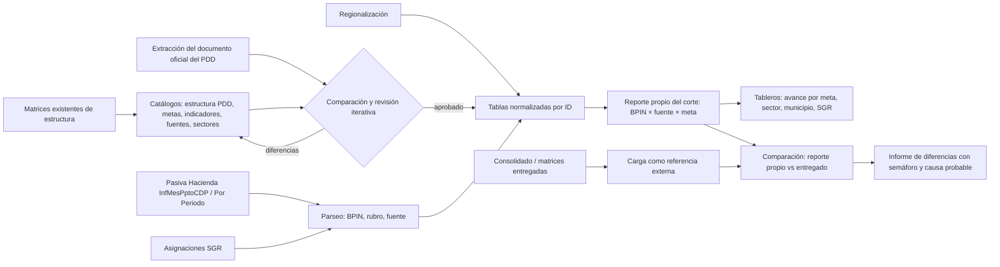

# In-Orbit Intelligence: lógica del módulo de seguimiento a metas e inversión (borrador)

> Rama: `module/in-orbit-intelligence`. Documento de diseño, sin código todavía. No se mergea a `main` hasta validar el MVP.

## 1. Qué hace el módulo

Consolida mes a mes la inversión pública del Departamento del Meta **por BPIN** y la amarra a las metas del Plan de Desarrollo Departamental (PDD). Así la Gerencia de Información y Estudios Económicos (DAPD) deja de armar a mano el consolidado en Excel, que hoy es la fuente de los errores descritos en la sección 5.

En concreto, el módulo:
1. Carga las fuentes oficiales de cada corte mensual: Hacienda/PCT, asignaciones SGR, matrices de las secretarías y regionalización.
2. Normaliza todo contra catálogos por ID (fuentes, dependencias, municipios DANE, estructura del PDD). No guarda texto libre.
3. Cruza por **BPIN × fuente × meta producto** y detecta diferencias entre lo que reporta la secretaría y lo que registra Hacienda.
4. Genera **su propio reporte mensual** directamente en la plataforma, a partir de sus bases y conciliado contra las pasivas de Hacienda.
5. Compara ese reporte con el que se entregó por la vía manual y marca cada diferencia.
6. Congela una foto por corte (abierto → en revisión → cerrado) y publica tableros e indicadores de avance financiero y físico.

> Enfoque: **primero construir, después comparar.** El consolidado manual no es la referencia a igualar, porque ya se encontraron errores en él (ver sección 5). La referencia es la lógica del módulo alimentada desde las fuentes oficiales.

## 2. Fuentes de datos (entradas)

| Fuente | Quién la entrega | Qué aporta | Llave de cruce |
|---|---|---|---|
| **Pasiva de Hacienda** (`InfMesPptoCDP`) | Hacienda (PCT), el día 1 de cada mes con corte al último día del mes anterior | Apropiación inicial, modificaciones, definitiva, CDP, compromisos (RP), obligaciones y pagos, por rubro | Rubro (`UUUU - 2.3.xx...`) y BPIN dentro del texto del concepto |
| **Ejecución "Por Periodo"** | Hacienda (PCT) | Lo mismo que la pasiva, con acumulado y valor del mes | Rubro y BPIN |
| **Asignaciones SGR** | Hacienda y el banco de proyectos (Gerico) | Techo plurianual del bienio, lo comprometido en vigencias anteriores y la ejecución de la vigencia | BPIN; la unidad `0320` corresponde al SGR |
| **Consolidado PDD** (hoja `1 SGTO AGOST pytos`) | Planeación, a partir de las matrices de las secretarías | Relación meta–BPIN reportada (la estructura del PDD sale de las matrices de estructura existentes, ver sección 6). Sus montos se usan **solo como reporte entregado a comparar**, no como verdad | Código de meta producto, BPIN y texto de la fuente |
| **Matrices de las secretarías** (`herramienta.xlsx`, una hoja por dependencia) | Cada secretaría o entidad (enlace) | Reporte mensual de la dependencia | Igual que el consolidado |
| **Regionalización / focalización** | Secretarías y Gerico | Municipios beneficiados por BPIN. Hoy viene en población, no en pesos | BPIN y código DANE |
| **Gerico** (a futuro, por API) | Banco de proyectos | Será la fuente de verdad del asignado y del estado del proyecto | BPIN |

## 3. Flujo de datos

Reglas clave:
- **Fila núcleo:** meta producto × proyecto (BPIN) × fuente. La relación proyecto–meta es N:M y se resuelve con una tabla pivote.
- **Montos acumulados:** se guardan CDP, RP, obligado y pagado acumulados; el valor del mes se calcula.
- **Validaciones:**
  - CDP ≥ RP ≥ obligado ≥ pagado.
  - Los acumulados no bajan entre cortes.
  - Lo reportado no supera el asignado.
  - El asignado reportado debe coincidir con la definitiva de PCT, con una tolerancia configurable.
- **SGR:** se manejan tres cifras: techo plurianual; techo de la vigencia (definitivo menos lo comprometido en vigencias anteriores); ejecución de la vigencia (RP con fecha del año en curso).
- **Focalización:** solo aplica a proyectos multimunicipio o META. En los de un solo municipio el municipio es fijo.
- **Trazabilidad:** cada valor guarda su archivo de origen, la fila y la fecha de la foto.

## 4. Salidas

- Tablero de avance por meta producto, meta resultado, programa y pilar.
- Inversión por municipio: mapa y ranking.
- **Reporte propio de agosto de 2026** generado en la plataforma.
- Informe de **diferencias frente al reporte entregado**, por BPIN, fuente y meta, con semáforo.
- Reportes por **sector** con sus proyectos asociados.
- Reporte de inconsistencias por dependencia, para devolverle al enlace.
- Foto mensual exportable a Excel y PDF, con acta de cierre del corte.

## 5. Errores del proceso actual que el módulo debe evitar

Todos los casos siguientes se encontraron en el corte de agosto de 2026.
- **BPIN copiado hacia abajo en las matrices.** Ejemplo: en la hoja AIM, `2023005500070` aparece en 5 filas que suman $38.634 M de asignado. En el consolidado solo tiene 1 fila de $2.948 M; las otras 4 filas pertenecen a los BPIN `2021005500215`, `2025005500024`, `2025005500036` y `2022005500031`, y además traen obligados distintos. **Regla:** el BPIN se valida contra el catálogo de proyectos, y un par BPIN–fuente duplicado genera una alerta.
- **Diferencias con Hacienda.** Para el mismo BPIN, PCT registra una definitiva de $2.888.976.155 y CDP, RP, obligado y pagado en 0. La secretaría reporta $2.948 M comprometidos. **Regla:** la conciliación contra PCT es obligatoria antes de cerrar el corte.
- **Varios BPIN en una misma celda** (33 filas) y filas sin BPIN (78). **Regla:** un BPIN por fila y un formato validado de 13 a 15 dígitos.
- **Fuentes escritas como texto libre** ("SRG - REGALIAS", "00AD - ASIGNACION DIRECTAS SGR"), además de que PCT recorta los códigos de fuente. **Regla:** catálogo de fuentes con código oficial y una tabla de equivalencias.
- **Metas resultado sin código** e indicadores genéricos que se repiten en varias metas. **Regla:** catálogos del PDD administrados por Planeación mediante un CRUD con auditoría.

## 6. Alcance del MVP: construir primero, comparar después

El MVP no busca igualar el reporte de agosto entregado. Construye su propia lógica, genera su propio reporte de agosto desde las bases y luego lo compara con lo entregado.

**Pasos del MVP:**
1. **Estructura del Plan de Desarrollo.** Crear las tablas jerárquicas del PDD (pilar/línea, sector, programa) con códigos oficiales.
2. **Catálogos de metas y fuentes.** Crear las tablas de metas, meta producto, meta resultado, indicadores (producto y resultado) y fuentes de financiación, todas con código e ID. No se usa texto libre.

   > **Base de modelado: las matrices existentes.** Las tablas de los pasos 1 y 2 se construyen a partir de las matrices que la Gerencia ya maneja para esas estructuras: la estructura del plan de desarrollo, las metas producto y resultado, los indicadores y el listado de fuentes de financiación. La estructura del PDD ya está bien trabajada en esas matrices, así que no se reinventa. Esas matrices son el punto de partida y la referencia: definen los niveles, los códigos, los nombres oficiales y las relaciones. El trabajo de ingeniería consiste en llevarlas a tablas normalizadas por ID, validar la integridad (códigos únicos y relaciones completas) y documentar los vacíos que aparezcan (por ejemplo, metas resultado sin código) para que Planeación los resuelva. No se trata de rediseñar la estructura.
3. **Validación de la estructura: extracción oficial frente a matrices (ciclo de calidad).** Antes de construir el reporte de agosto:
   - La Gerencia extrae la estructura directamente del **documento oficial del Plan de Desarrollo** y la entrega en archivos: uno con las **metas codificadas** y otro con las **fuentes de financiación**. Es posible que la estructura completa del PDD ya exista en otra plataforma; en ese caso se define cómo compartirla (exportación o acceso) y se usa como fuente.
   - Esa extracción se carga en tablas de staging y se compara, código por código, con las matrices existentes que sirvieron de base en los pasos 1 y 2.
   - Se marcan las diferencias: códigos que están en un lado y no en el otro, nombres o textos distintos, metas asignadas a otro programa o sector, indicadores con otra unidad o meta cuatrienal, y fuentes con otro código o nombre.
   - Las diferencias se revisan con Planeación **en ciclos**: se corrige la tabla, se vuelve a cargar y se vuelve a comparar hasta que no queden diferencias sin resolver. Cada decisión queda registrada con su justificación y su fuente.
   - **Condición de salida:** los catálogos del PDD y de fuentes quedan aprobados como versión oficial. Solo entonces se alimenta el reporte de agosto (pasos 5 a 7).
4. **BPIN por sector.** Relacionar cada BPIN con su sector (y con sus metas mediante la pivote N:M) para sacar reportes por sector con sus proyectos asociados.
5. **Tabla del reporte de agosto alimentada desde las bases.** Cada fila BPIN × fuente × meta toma sus montos (definitiva, CDP, RP, obligado, pagado) de las pasivas de Hacienda (`InfMesPptoCDP`) y de las asignaciones SGR, con las validaciones de la sección 3.
6. **Reporte de agosto propio.** Generarlo directamente en la plataforma, exportable a Excel y PDF.
7. **Comparación final.** Cargar el reporte entregado como referencia externa y cruzarlo contra el propio por BPIN, fuente y meta. Cada diferencia queda marcada con su tipo:
   - BPIN que aparece en un reporte y no en el otro.
   - BPIN duplicado o arrastrado (caso `2023005500070`).
   - Monto distinto (asignado, comprometido u obligado) con la diferencia en pesos y en %.
   - Fuente o meta asignada distinta.

**Queda fuera del MVP, para después:** digitación directa de las secretarías en el portal, API de Gerico, evidencias fotográficas, focalización en pesos, actividades y avance físico por actividad.

**Criterio de éxito:** los catálogos del PDD y de fuentes quedan validados contra el documento oficial, sin diferencias abiertas; el módulo genera su propio reporte de agosto de 2026 desde las bases, conciliado con las pasivas de Hacienda, y el informe de comparación identifica todas las diferencias frente al reporte entregado, incluidos los errores conocidos de la sección 5. Cada diferencia debe poder explicarse por su fuente de origen.

## 6.1 Comparación con base de datos en producción

> **Placeholder.** Esta sección se completa cuando se reciba la base de datos.

La Gerencia tiene una **base de datos en producción ya poblada con la estructura completa del Plan de Desarrollo**. La va a descargar y compartir (dump o exportación). Cuando llegue, se agrega como una tercera fuente al ciclo de validación del paso 3.

**Flujo de comparación:**
1. **Recepción y carga.** El dump se restaura en un esquema de staging aislado, de solo lectura, sin tocar las tablas del módulo. Se documentan la fecha de corte, el motor y la versión de origen.
2. **Mapeo.** Se relacionan sus tablas y campos con los catálogos del módulo: plan de desarrollo, metas, meta producto, meta resultado, indicadores y fuentes de financiación.
3. **Comparación a tres bandas**, código por código:
   - Base de producción frente a las matrices existentes.
   - Base de producción frente a la extracción del documento oficial del PDD.
   - Matrices frente a la extracción oficial (la comparación que ya hace el paso 3).
4. **Diferencias.** Se marcan los códigos que faltan en alguna fuente, los nombres distintos, las jerarquías distintas (meta bajo otro programa o sector), los indicadores con otra unidad o meta y las fuentes con otro código. Cada diferencia indica qué fuente tiene cada valor.
5. **Revisión iterativa con Planeación.** Se decide qué valor queda y se registra la decisión con su justificación. Criterio propuesto, pendiente de validar con Planeación: manda el documento oficial del PDD, y la base de producción y las matrices se corrigen contra él.
6. **Resultado.** Los catálogos aprobados quedan como la versión oficial que alimenta la construcción del reporte de agosto (pasos 5 a 7 de la sección 6).

**Pendiente:** recibir el dump de la base de producción y confirmar su motor (MySQL/MariaDB, PostgreSQL, etc.) y su esquema.

## 7. Referencias

- Modelo de datos de 27 tablas, `schema.sql` y el diagrama entidad–relación: se generaron fuera de este repo y se incorporarán en `docs/`.
- El módulo existente de inversión pública está en `docs/inversion-publica.md` (datos.gov.co). Este módulo lo complementa con las fuentes internas: PCT, SGR y las matrices de las secretarías.

## 8. Catálogos implementados

Primeros catálogos del módulo, con el mismo CRUD y las mismas herramientas de Excel. La pantalla de cada uno está en `/inteligencia/dependencias`, `/inteligencia/municipios` y `/inteligencia/reglas-pasiva`.

**Tablas**

- `dependencias`: código único, nombre, sigla, tipo (`central`, `descentralizado`, `por_confirmar`), hoja de la matriz, activo y borrado lógico. Semilla de 27 filas tomada de la matriz mensual (`database/seeders/data/dependencias.csv`). El tipo es una clasificación editable.
- `municipios`: código DANE de 5 dígitos, nombre, subregión y activo. Semilla de los 29 municipios del Meta (`database/seeders/data/municipios_meta.csv`). No existía una tabla de municipios: el mapa de inversión pública guarda el municipio como texto en las localizaciones, así que este catálogo es nuevo y todavía no reemplaza ese texto.
- `dependencia_reglas_pasiva`: regla para reconocer la dependencia de una fila de la pasiva. Guarda `dependencia_id` (no el nombre), tipo (`unidad_pct`, `prefijo_rubro`, `sector_mga`, `bpin`), valor, prioridad, vigencia opcional y activo. No hay semilla: la unidad PCT sola no identifica la dependencia (`0301` mezcla secretarías y `0320` es SGR de varias) y el mapa unidad → dependencia todavía no está confirmado.

**Excel, solo administrador técnico**

El rol sigue siendo la columna `users.role` (`App\Enums\UserRole`). Crear, editar, eliminar, exportar, importar y descargar la plantilla solo los ve y los ejecuta el administrador técnico (`admin`), en la vista y en la política `IntelligenceCatalogPolicy`, además del middleware `role:admin`. El resto de los roles autenticados ve el listado en solo lectura.

Los libros `.xlsx` se leen y escriben con `openspout/openspout` (el proyecto no tenía un paquete de Excel). Cada catálogo ofrece **Descargar todo**, **Importar desde Excel** (crea o actualiza por la llave natural y no guarda nada si hay errores) y **Descargar plantilla** (encabezados, una fila de ejemplo y una hoja de instrucciones con los valores permitidos).

Para el siguiente catálogo basta una migración, un modelo, una subclase de `App\Services\Intelligence\Catalogs\CatalogDefinition`, un controlador que extienda `CatalogController` y las mismas nueve rutas. Las relaciones guardan el id o el código del catálogo, no texto libre.

**Identificación en la pasiva**

`ResolverDependenciaPasiva` recibe la identificación presupuestal y el concepto, y devuelve el `dependencia_id` de la regla activa que coincide. La prioridad por defecto es BPIN (400), prefijo de rubro (300), sector MGA (200) y unidad PCT (100); si hay empate, gana el valor más largo. Una regla con vigencia solo aplica cuando se informa el año y cae en el rango. El importador de la pasiva queda para después.

En `database/seeders/data/` quedaron, sin tabla todavía, las exportaciones de producción: `estructura_plan_desarrollo.json` (482 filas), `fuentes_financiacion.json` (256) y `productos_mga.json` (291).

## 9. Estructura del PDD, metas e indicadores de resultado

La estructura del plan y las metas de producto salen de `database/seeders/data/estructura_plan_desarrollo.json` (482 filas de producción). Las metas de resultado salen de `database/seeders/data/metas_resultado_matriz.csv` (122 filas de la matriz mensual). El libro de comparación producción vs matriz se usó solo para entender los códigos que no coinciden: no reasigna ninguno.

**Tablas**

Cada nivel guarda `codigo` (el de producción, 11 dígitos), `numeral` (el rótulo punteado leído del nombre, por ejemplo `1.1.1.1.1`; vacío si el nombre no lo trae), `nombre` sin ese prefijo, el padre, `activo` y borrado lógico.

| Tabla | Filas | Padre |
|---|---|---|
| `pdd_pilares` | 5 | — |
| `pdd_ejes` | 5 | pilar |
| `pdd_lineas` | 35 | eje |
| `pdd_programas` | 80 | línea |
| `pdd_subprogramas` | 215 | programa |
| `sectores_mga` | 16 | — (código de dos dígitos, p. ej. `04`, `45`) |
| `metas_producto` | 482 | subprograma y sector MGA; `meta_resultado_id` y `dependencia_id` opcionales |
| `indicadores_resultado` | 98 | — |
| `metas_resultado` | 122 | indicador, y programa o subprograma cuando las metas de producto asociadas lo comparten |

No hay tabla pivote `meta_resultado_indicador`. Cada fila de la matriz trae un solo nombre de indicador y no hubo atributos en conflicto, así que la relación queda N:1 (`metas_resultado.indicador_resultado_id`).

El código oficial de la meta de resultado y del indicador queda **nulo**. La matriz no los trae y no se inventan. La meta se identifica con `codigo_provisional` (`MR-001` … `MR-122`, tomado de `id_matriz`). La importación de metas de resultado actualiza por ese provisional; la de indicadores, por el nombre.

**Semilla de metas de resultado** (`php artisan migrate:fresh --seed`)

- 384 metas de producto quedaron ligadas por código.
- 20 códigos de la matriz no están en las 482 de producción y se dejaron sin ligar: `21053013201`, `21061023202`, `21061023203`, `21083033502`, `21093013301`, `21101041301`, `41053014102`, `41072051901`, `41072081901`, `41072081904`, `41072081905`, `41072081906`, `41072131901`, `41082012201`, `41093030000`, `41984012201`, `61011024501`, `61011034501`, `61011034502`, `61011034503`.
- 14 metas de resultado quedaron sin metas de producto (`MR-012`, `MR-025`, `MR-029`, `MR-044`, `MR-045`, `MR-046`, `MR-048`, `MR-079`, `MR-093`, `MR-094`, `MR-098`, `MR-110`, `MR-114`, `MR-119`). Once de esas filas venían sin códigos; las otras tres solo traían códigos ausentes en producción.
- 30 metas de resultado quedaron sin programa: las 14 anteriores y otras cuyas metas de producto no comparten un solo programa. Si todas comparten subprograma, se guardan subprograma y programa. Si solo comparten programa, se guarda el programa y el subprograma queda vacío.
- 98 indicadores, uno por nombre distinto. `MR-096` (prevalencia de consumo de marihuana en población escolar) no trae nombre de indicador: no se creó uno ni se copió la descripción. Su `indicador_resultado_id` queda nulo.
- Unidad, orientación, línea base y meta de cuatrienio vienen vacías en la matriz, así que esos campos quedan nulos.
- La dependencia de cada meta de producto queda vacía hasta que Planeación la confirme.

El detalle queda en `storage/app/seed-reports/metas_resultado.csv` y los padres ajustados en `storage/app/seed-reports/estructura_plan.csv`.

**Padres que la exportación repite**

Tres subprogramas aparecían bajo más de un programa porque algunas filas ponen el texto de una meta en las columnas de programa. Se conservó el programa estructural (código terminado en `00000`, o el numeral padre cuando ese código no venía en la fila) y se registró el descarte:

- `11012020000` quedó en `11012000000` (se descartó `11012024503`).
- `41082010000` quedó en `41082000000` (se descartó `41082012201`).
- `41072080000` quedó en `41072000000` por el numeral `4.1.7.2` (se descartaron `41072081901` y `41072081906`).

Esos ocho códigos de “programa” sin numeral siguen en `pdd_programas` porque están en la exportación: `11012024503`, `21053013201`, `21093013301`, `41072051901`, `41072081901`, `41072081906`, `41072131901`, `41082012201`. No se les cuelga el subprograma cuando hay un programa estructural.

**Borrado**

No hay cascada. No se elimina un registro que todavía tenga hijos vigentes (ejes, líneas, programas, subprogramas, metas de producto o metas de resultado, según el nivel). Un hijo ya eliminado no bloquea. La clave foránea también impide el borrado físico.

**Pantallas y consultas**

En Seguimiento a metas: pilares, ejes, líneas, programas, subprogramas, sectores MGA, metas producto, indicadores de resultado y metas resultado. El mismo patrón de la sección 8: el administrador técnico crea, edita, elimina, descarga, importa y baja la plantilla; los demás roles autenticados ven el listado. Las metas de producto se filtran por meta de resultado, subprograma, sector y dependencia. Las metas de resultado, por programa e indicador. El formulario elige los padres en listas; el subprograma se reduce al programa elegido.

Consultas de solo lectura, con sesión:

- `GET /inteligencia/api/estructura` — árbol pilar → eje → línea → programa → subprograma.
- `GET /inteligencia/api/metas-resultado/{id}` — la meta, su indicador, la cadena del programa y sus metas de producto.

**Preguntas abiertas para Planeación**

1. ¿Cuál es el código oficial de cada meta de resultado y de cada indicador? Hoy solo existe `MR-001` … `MR-122`.
2. Los 20 códigos de la matriz que no están en producción: ¿se descartan o alguno equivale a una meta de producción? El libro de comparación muestra textos parecidos (por ejemplo el texto de `21061023203` en la matriz coincide con el de `21061023201` en producción, y el de `21061023202` con el de `21061033202`). No se aplicó ninguna equivalencia.
3. Las 14 metas sin metas de producto y las 30 sin un programa único, ¿cómo deben quedar en el reporte?
4. `MR-096` no trae indicador. ¿El indicador es la propia descripción u otro ya existente?
5. Los ocho “programas” sin numeral parecen metas escritas en la columna de programa. ¿Se corrigen en la fuente o se dejan como están?
6. Unidad, orientación, línea base, meta de cuatrienio y fuente de verificación de los indicadores siguen vacías.
7. ¿Qué dependencia responsable corresponde a cada meta de producto?
